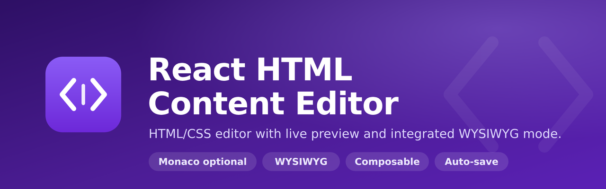

<p align="center">
  
</p>

# React HTML Content Editor

[](https://www.npmjs.com/package/react-html-content-editor)
[](https://github.com/adrianomaringolo/react-html-content-editor/actions)
[](https://github.com/adrianomaringolo/react-html-content-editor/actions)
[](https://opensource.org/licenses/MIT)

A sophisticated HTML and CSS content editor with multiple view modes, scroll synchronization, and auto-save functionality — plus optional Monaco Editor integration for syntax highlighting and formatting.

## Project Structure

This is a pnpm workspace monorepo containing:

- `packages/library` - The main library package
- `packages/demo` - Demo application showcasing the library

## 🌐 Live Demo

Check out the live demo and documentation: [https://adrianomaringolo.github.io/react-html-content-editor/](https://adrianomaringolo.github.io/react-html-content-editor/)

The demo is automatically deployed to GitHub Pages on every push to `main`.

## Getting Started

### Prerequisites

- Node.js >= 18.0.0
- pnpm >= 8.0.0

### Installation

```bash
pnpm install
```

### Development

Run the demo app in development mode:

```bash
pnpm dev
```

Build the library:

```bash
pnpm build
```

Build all packages:

```bash
pnpm build:all
```

Run tests:

```bash
pnpm test
```

## Packages

### react-html-content-editor

The main library package. See `packages/library/README.md` for detailed documentation.

### demo

Demo application showcasing all features of the library.

## License

MIT

## 🚀 Release Process

This project uses automated releases with Changesets and GitHub Actions.

### Quick Start

1. Make your changes
2. Create a changeset: `pnpm changeset`
3. Commit and push to `main`
4. GitHub Actions will create a Release PR
5. Merge the PR to publish to npm automatically

For detailed instructions, see [RELEASE.md](./RELEASE.md).

### Manual Release

```bash
# Create a changeset
pnpm changeset

# Version packages (updates package.json and CHANGELOG)
pnpm changeset version

# Build and publish
pnpm release
```

## 📚 Documentation

- [Published Documentation](https://adrianomaringolo.github.io/react-html-content-editor/)
- [Library Documentation](./packages/library/README.md)
- [Live Demo](https://adrianomaringolo.github.io/react-html-content-editor/)
- [GitHub Pages Setup](./docs/GITHUB_PAGES_SETUP.md)
- [Release Process](./RELEASE.md)
- [Release Quick Guide](./docs/RELEASE_QUICK_GUIDE.md)
- [Setup Checklist](./docs/SETUP_CHECKLIST.md)
- [Contributing Guide](./packages/library/CONTRIBUTING.md)
- [Keyboard Shortcuts](./packages/library/KEYBOARD_SHORTCUTS.md)

## 🤝 Contributing

Contributions are welcome! Please read our [Contributing Guide](./packages/library/CONTRIBUTING.md) and [Release Process](./RELEASE.md) before submitting a PR.
